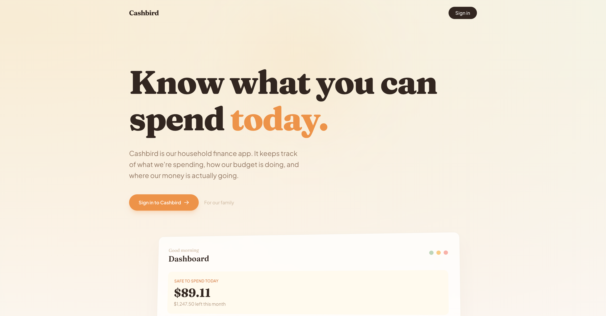

# Cashbird

A personal finance app for my household. It answers the two questions we ask every day: "what can we spend?" and "where did our money go?"

It's not a SaaS product or a startup -- it's a household tool that connects to our bank accounts, categorizes transactions, builds budgets with AI, and gives us a shared view of our money. The interface is designed to be clear for everyone in the household, even if you don't think about money all day.



## What it does

**Daily spending allowance.** The dashboard opens with a "safe to spend" number -- how much is left in each budget category divided by the remaining days in the month. This is the thing we actually check every morning.

**AI-generated budgets.** Instead of manually setting up budget categories, Cashbird analyzes your spending history and proposes a budget. You review and adjust the suggestions, but the starting point is real data rather than guesswork.

**Bank account sync.** Connects to bank accounts through the [Teller API](https://teller.io/) to pull in transactions automatically. Transactions get categorized by an AI agent, with the option to override categories manually.

**Debt payoff planner.** Tracks debts with balances, interest rates, and minimum payments, then projects a payoff timeline using the avalanche method. Shows you a "debt-free by" date.

**AI insights and reports.** Generates periodic observations about spending patterns -- things like "your dining spend increased 23% this month" or "you have 3 recurring charges you might want to review." Monthly reports summarize everything.

**Natural language chat.** An "Ask Cashbird" interface where you can type questions like "how much did I spend on groceries in March?" and get answers from your actual transaction data.

**Household sharing.** Multiple household members can access shared budgets and categories through WorkOS FGA (fine-grained authorization). Not multi-tenant SaaS -- just a family sharing one set of finances.

**MCP server.** Exposes financial data through a Model Context Protocol server, so you can query budgets, transactions, debt status, and insights from Claude or other MCP clients.

## Tech stack

- **PHP 8.4 / Laravel 13** -- the framework handles routing, queues, scheduling, and the AI SDK integration
- **Livewire 4** -- all interactive UI is server-rendered Livewire components (no React/Vue)
- **Alpine.js** -- client-side interactions like keyboard shortcuts and the command palette
- **Tailwind CSS v4** -- warm OKLCH color palette (sand, amber, sage, terracotta) instead of the usual cold grays
- **WorkOS AuthKit** -- authentication and fine-grained authorization for household sharing
- **Teller API** -- bank account connections and transaction sync
- **Laravel AI SDK + Cloudflare Workers AI** -- powers budget generation, transaction categorization, insights, reports, and the chat interface. Uses a two-tier model strategy: a capable model (GLM-4.7-Flash) for agentic tasks and a cheap model (Gemma 4) for classification. Routed through Cloudflare AI Gateway for caching and analytics
- **PostgreSQL** -- primary database
- **Redis** -- queues and caching
- **Vite + Bun** -- frontend build tooling

### Design details

The visual direction is warm and calm -- cream backgrounds, Fraunces for display headings, Plus Jakarta Sans for body text, and Phosphor Icons throughout. The landing page has a Stripe-inspired scroll animation built with GSAP and ScrollTrigger. The app supports keyboard navigation (`g` then a letter to jump to any section, `Cmd+K` for a command palette, `?` for shortcut help) and contextual help tooltips on financial terms.

## Local setup

### Prerequisites

- PHP 8.4+ with the `phpredis` extension
- Composer
- PostgreSQL 16+ with the [pgvector](https://github.com/pgvector/pgvector) extension (required for semantic search on transactions)
- Redis
- Bun (or Node.js, but Bun is preferred)

### Install

```bash
git clone git@github.com:birdcar/cashbird.git
cd cashbird
composer setup
php artisan db:seed --class=CategorySeeder
```

`composer setup` handles `composer install`, copying `.env.example`, generating an app key, running migrations, installing JS deps, and building frontend assets.

The `CategorySeeder` is **required** -- it populates the system category hierarchy (13 parent categories, ~45 total) that transaction categorization, budget allocation, and the AI agents all depend on.

### Configure external services

Cashbird depends on three external services: WorkOS (auth), Cloudflare Workers AI (AI features), and Teller (bank connections). Each requires some dashboard setup before the app will work.

> **Note:** The app runs on a Tailscale tailnet, so it is not publicly accessible. WorkOS webhooks won't work -- instead, Cashbird polls the WorkOS Events API with a long-running worker process included in `composer dev`.

#### 1. WorkOS (authentication + authorization)

All authentication goes through WorkOS AuthKit. There is no username/password login -- WorkOS handles the entire auth flow.

**Create an AuthKit application:**

1. Go to [WorkOS Dashboard](https://dashboard.workos.com) > **Authentication** > **AuthKit**
2. Note your **Client ID** (starts with `client_`) and **API Key** (starts with `sk_`) from the dashboard
3. Set these in `.env`:
   ```
   WORKOS_CLIENT_ID=client_...
   WORKOS_API_KEY=sk_...
   ```

**Configure the redirect URI:**

1. In the AuthKit settings, add a redirect URI: `http://localhost:8000/auth/callback` (or whatever your `APP_URL` is + `/auth/callback`)
2. Set it in `.env`:
   ```
   WORKOS_REDIRECT_URI=http://localhost:8000/auth/callback
   ```

**Create an organization (required for household sharing):**

1. Go to **Organizations** > **Create Organization**
2. Name it whatever you want (e.g. your household name)
3. Note the Organization ID (starts with `org_`)
4. Add yourself and any household members as Organization Members
5. Set it in `.env`:
   ```
   WORKOS_ORGANIZATION_ID=org_...
   ```

**Set up Fine-Grained Authorization (FGA):**

FGA controls who can view/edit shared budgets and reports. Skip this if you're the only user -- but you'll need it for household sharing.

1. Go to **Authorization** > **Resource Types**
2. Create resource type `budget_category`:
   - Add role `owner` with permissions: `budget_category:view`, `budget_category:edit`
   - Add role `editor` with permissions: `budget_category:view`, `budget_category:edit`
   - Add role `viewer` with permissions: `budget_category:view`
3. Create resource type `report`:
   - Add role `owner` with permissions: `report:view`
   - Add role `viewer` with permissions: `report:view`

**Enable CIMD (optional, for MCP server):**

If you want to use the Cashbird MCP server from Claude Desktop or other MCP clients:

1. Go to **Connect** > **Configuration**
2. Enable CIMD (Client ID Metadata Document)

#### 2. Cloudflare Workers AI

Cashbird uses Cloudflare Workers AI through AI Gateway for all AI features: budget generation, transaction categorization, spending insights, reports, and the chat interface. Only the AI Gateway is used -- no Workers, D1, or R2.

1. Go to [Cloudflare Dashboard](https://dash.cloudflare.com) > **AI** > **AI Gateway**
2. Create a new gateway (name it whatever you want)
3. Copy the gateway URL. The format is:
   ```
   https://gateway.ai.cloudflare.com/v1/{account_id}/{gateway_name}/workers-ai/v1
   ```
4. Go to **My Profile** > **API Tokens** > **Create Token**
5. Use the "Workers AI" template, or create a custom token with the `Workers AI: Read` permission
6. Set both in `.env`:
   ```
   CLOUDFLARE_AI_GATEWAY_URL=https://gateway.ai.cloudflare.com/v1/.../workers-ai/v1
   CLOUDFLARE_AI_API_TOKEN=...
   ```

The default models are already configured in `.env.example`. Override if needed:

| Variable | Default | Purpose |
|---|---|---|
| `AI_MODEL_SMARTEST` | `@cf/zhipu/glm-4.7-flash` | Agentic tasks (budgets, reports, chat) |
| `AI_MODEL_CHEAPEST` | `@cf/google/gemma-4-26b-a4b-it` | Classification (categorization) |
| `AI_EMBEDDING_MODEL` | `@cf/baai/bge-base-en-v1.5` | Transaction embeddings for semantic search |

**Alternative providers:** Set `AI_PROVIDER=anthropic` (+ `ANTHROPIC_API_KEY`), `AI_PROVIDER=openai` (+ `OPENAI_API_KEY`), or `AI_PROVIDER=ollama` (+ `OLLAMA_BASE_URL`) to use a different backend. Cloudflare is the default because it's the cheapest option.

#### 3. Teller (bank connections)

Teller provides bank account linking and transaction sync. AI features work without Teller (you just won't have any transaction data).

1. Register at [teller.io](https://teller.io) and create an application
2. Note your **Application ID** (starts with `app_`)
3. Download the mTLS certificate pair from the Teller Dashboard. Store the files somewhere persistent (e.g. `~/.teller/`)
4. Set in `.env`:
   ```
   TELLER_APP_ID=app_...
   TELLER_CERT_PATH=/absolute/path/to/certificate.pem
   TELLER_KEY_PATH=/absolute/path/to/private_key.pem
   ```

The mTLS cert/key are optional for local development -- the Teller client skips certificate attachment if the paths are empty. Transactions sync automatically every hour (incremental) and every 6 hours (full), or on demand via the "Sync Now" button on the Accounts page.

#### 4. Database

Create a PostgreSQL database and user:

```sql
CREATE USER cashbird;
CREATE DATABASE cashbird OWNER cashbird;
\c cashbird
CREATE EXTENSION IF NOT EXISTS vector;
```

The `vector` extension is required for semantic search on transactions. Without it, the migration falls back to a `text` column and semantic search won't work.

Set your credentials in `.env`:
```
DB_HOST=127.0.0.1
DB_PORT=5432
DB_DATABASE=cashbird
DB_USERNAME=cashbird
DB_PASSWORD=
```

### Run

```bash
composer run dev
```

This starts five processes concurrently:

| Process | What it does |
|---|---|
| `php artisan serve` | Laravel dev server |
| `php artisan queue:listen` | Queue worker for background jobs |
| `php artisan pail` | Real-time log tail |
| `bun run dev` | Vite dev server (hot reload) |
| `php artisan workos:poll-events` | Polls WorkOS Events API every 15s for user/org/membership sync |

## Tests

243 PHPUnit tests covering authentication, budget calculations, transaction sync, debt projections, AI agents, sharing flows, savings goals, net worth tracking, and more.

```bash
# Run all tests
php artisan test --compact

# Run a specific test file
php artisan test --compact tests/Feature/ReadyToSpendTest.php

# Filter by test name
php artisan test --compact --filter=testAvalancheCalculator
```

## Project structure

```
app/
  Livewire/          # Livewire components (Dashboard, Budget, Debt, Chat, etc.)
  Mcp/               # MCP server and tools
  Services/          # Business logic (budget calculation, debt projection, Teller client)
resources/
  views/livewire/    # Blade templates for each Livewire component
  views/components/  # Shared UI components (help tooltips, layout)
  views/welcome.blade.php  # Landing page
tests/
  Feature/           # 26 feature test classes
  Unit/              # Unit tests
```

## Deployment

Cashbird is deployed with [Coolify](https://coolify.io/), a self-hosted PaaS.

### Coolify setup

1. **Create a new resource** in Coolify pointing to the `birdcar/cashbird` GitHub repo
2. **Build pack**: Nixpacks (auto-detects Laravel)
3. **Environment variables** — set the same ones from `.env.example` in Coolify's environment tab:
   - `APP_ENV=production`, `APP_DEBUG=false`, `APP_URL=https://your-domain.com`
   - Database: `DB_CONNECTION=pgsql`, `DB_HOST`, `DB_DATABASE`, `DB_USERNAME`, `DB_PASSWORD`
   - Redis: `REDIS_HOST`, `REDIS_PASSWORD` (if applicable)
   - WorkOS: `WORKOS_CLIENT_ID`, `WORKOS_API_KEY`, `WORKOS_REDIRECT_URI`, `WORKOS_ORGANIZATION_ID`
   - Teller: `TELLER_APP_ID`, cert/key paths
   - AI: `CLOUDFLARE_AI_GATEWAY_URL`, `CLOUDFLARE_AI_API_TOKEN`
4. **Post-deploy command** — Coolify runs this after each deploy:
   ```bash
   php artisan migrate --force && php artisan config:cache && php artisan route:cache && php artisan view:cache
   ```
5. **Persistent storage** — mount `/app/storage` to persist logs, cache, and sessions across deploys
6. **Services** — Coolify should also run PostgreSQL (with pgvector) and Redis as linked services, or point to external instances
7. **Queue worker** — add a worker process: `php artisan queue:work --sleep=3 --tries=3 --max-time=3600`
8. **WorkOS events poller** — add a worker process: `php artisan workos:poll-events` (replaces webhooks since the app isn't publicly accessible)
9. **Scheduler** — add a cron process: `php artisan schedule:work` (or configure a cron job for `php artisan schedule:run` every minute)

### Build

Coolify's Nixpacks build will detect the Laravel app and handle PHP/Composer/Bun installation. The `bun run build` step compiles frontend assets during the build phase.

## License

MIT
